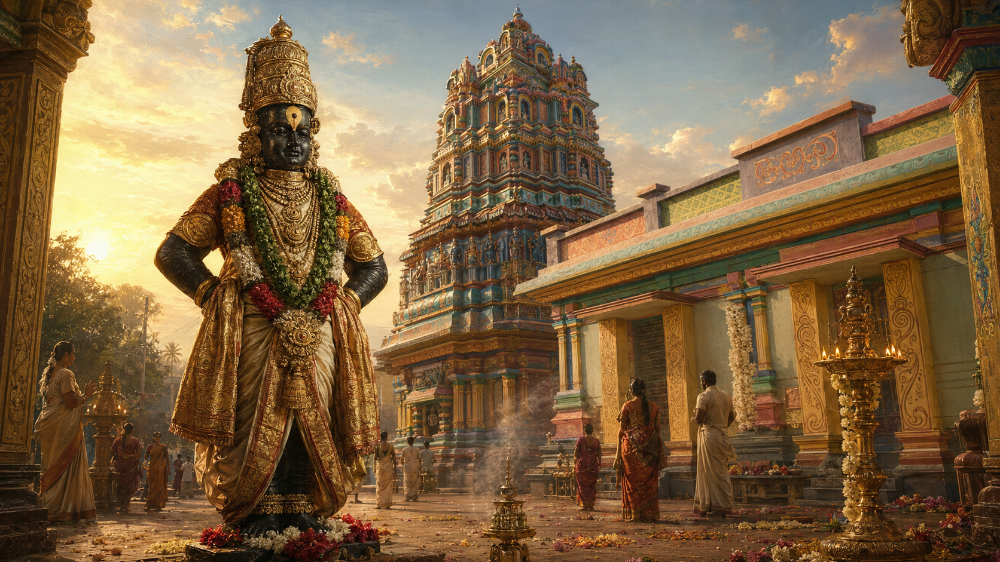
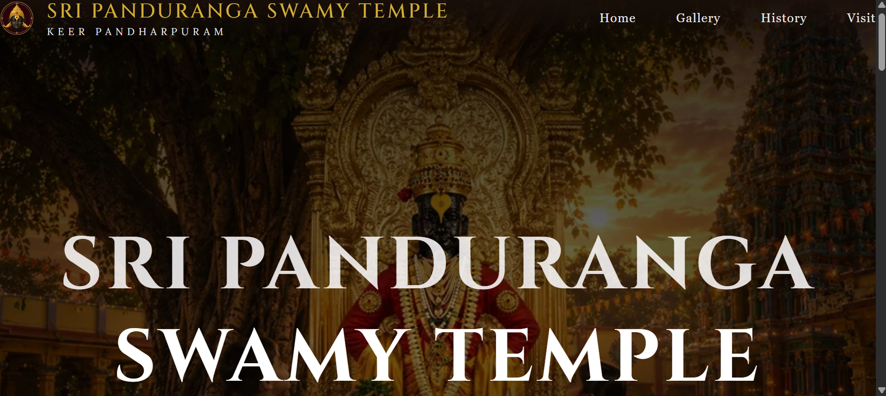
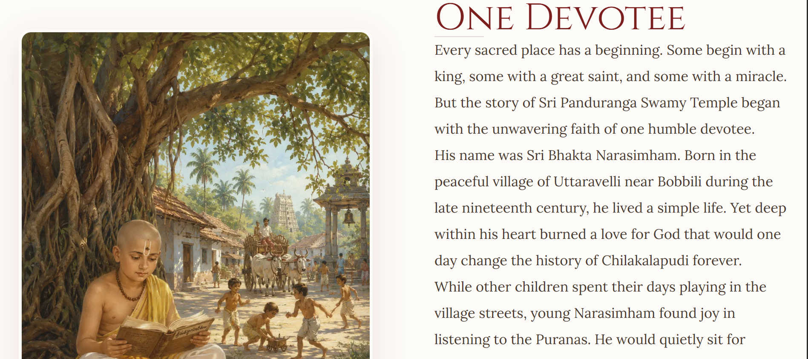
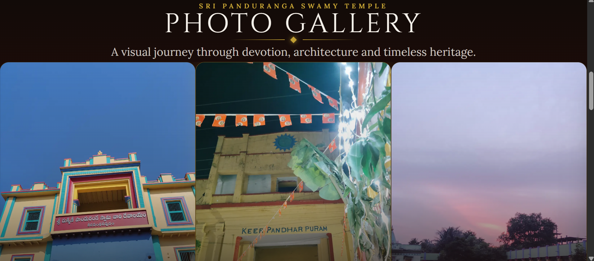
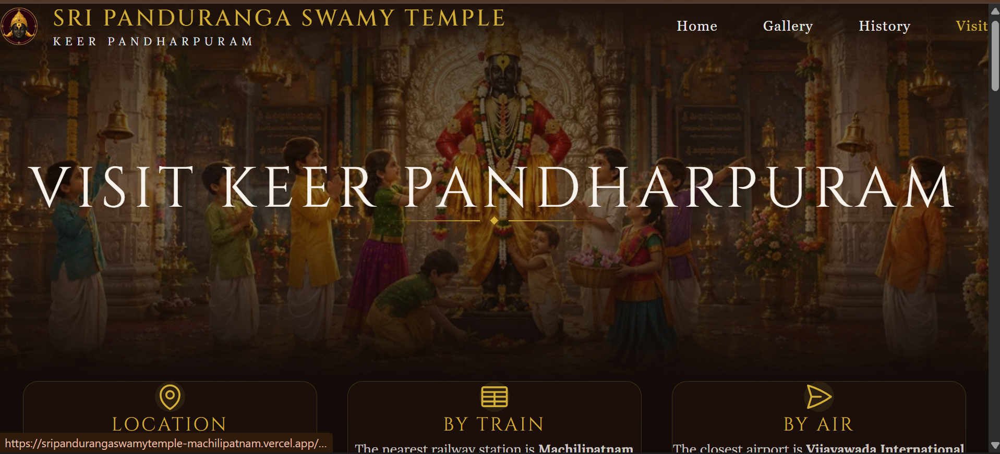

  

<h1 align="center">
🛕 Sri Panduranga Swamy Temple
</h1>

<h3 align="center">
A Digital Heritage Project for Keera Pandharipuram
</h3>

Preserving Faith • History • Architecture • Devotion

---

# 📑 About the Project

Sri Panduranga Swamy Temple is more than a place of worship—it is a living heritage shaped by generations of devotion, faith, culture, and timeless traditions.

This project was created as a **Digital Heritage Initiative** to preserve the temple's remarkable history and present it through a modern yet deeply devotional web experience.

Instead of functioning as a conventional temple website, it invites visitors to experience the temple through illustrated storytelling, heritage-inspired design, photography, history, architecture, and pilgrimage guidance.

Every illustration, photograph, color, and interaction has been thoughtfully crafted to evoke the feeling of walking through the sacred temple itself.

---

# ✨ Inspiration

Many temples possess extraordinary histories that slowly fade with time because they remain undocumented in digital form.

Sri Panduranga Swamy Temple, Chilakalapudi, is one such sacred place.

Inspired by the devotion of **Sri Bhakta Narasimham** and the miraculous origins of the temple, this project aims to preserve its legacy for future generations through technology.

This website is my humble digital offering at the Lotus Feet of Lord Panduranga.

---

# 🌟 Features

- 🛕 Immersive Heritage Homepage
- 📖 Illustrated Historical Chronicle
- 📷 Temple Photography Archive
- 🗺️ Visitor Information & Travel Guide
- 🌿 Sacred Highlights Around the Temple
- 📱 Fully Responsive Design
- 🎨 Heritage Inspired UI & Typography
- 🌙 Elegant Maroon & Gold Theme
- ⚡ Optimized Performance
- 🔍 SEO Friendly Structure

---

# 🖼️ Screenshots

## 🏛️ Homepage

A cinematic welcome experience inspired by Indian heritage paintings.

---

## 📖 The Sacred Chronicle

A seven-chapter illustrated historical journey narrating the miraculous origins of Sri Panduranga Swamy Temple.

---

## 📸 Temple Through My Lens

A photography archive preserving the architecture, traditions, sacred spaces, and timeless beauty of the temple.

---

## 🚩 Visit Keera Pandharipuram

Helping devotees plan their pilgrimage with travel guidance, temple highlights, and important visitor information.

---

# 🎨 Design Philosophy

The visual identity of this project is inspired by

- Raja Ravi Varma Paintings
- Traditional Indian Temple Architecture
- Heritage Museums
- Ancient Manuscripts
- South Indian Temple Culture
- Devotional Art
- Warm Earth Tones

The interface was intentionally designed to feel like reading an ancient illustrated chronicle rather than browsing a modern website.

---

# 🎨 Color Palette

| Color | Hex |
|------|------|
| Background | `#F8F4E8` |
| Surface | `#FFF9ED` |
| Maroon | `#7B1E1E` |
| Gold | `#D4AF37` |
| Green | `#2E6B3A` |
| Brown | `#4B2E20` |
| Blue | `#135D66` |
| Text | `#2C1E16` |

---

# 🛠️ Built With

- Next.js
- TypeScript
- Tailwind CSS
- Framer Motion
- React Icons
- Google Fonts (Cinzel & Lora)
- Vercel

# 📖 Website Sections

## 🏠 Home

Introduces visitors to the temple through cinematic visuals and devotional storytelling.

---

## 📷 Gallery

A curated collection of temple photography captured by devotees, preserving architecture, sacred spaces, and moments of devotion.

---

## 📜 History

The heart of the website.

Presented as a beautifully illustrated seven-chapter storybook chronicling the miraculous origins of the temple.

### Chapters

- Every Sacred Place Begins With One Devotee
- A Journey That Changed Everything
- A Dream Offered to the Lord
- The Divine Promise
- The Sacred Foundation
- Faith Was Put to the Test
- The Lord Kept His Promise

---

## 🚩 Visit

Provides essential travel information, nearby transport options, temple highlights, and pilgrimage guidance.

---

# 📱 Responsive Design

The website has been carefully designed for

- Desktop
- Laptop
- Tablet
- Mobile

ensuring a seamless experience across all screen sizes.

---

# 🚀 Performance Goals

- ⚡ Fast Loading
- 📱 Mobile First
- ♿ Accessibility Focused
- 🖼️ Optimized Images
- 🔍 SEO Friendly
- 🌍 Future Internationalization

---

# 🌱 Future Roadmap

- [ ] Telugu Translation
- [ ] Interactive Temple Timeline
- [ ] Festival Calendar
- [ ] Temple Audio Guide
- [ ] Community Photo Submission Portal
- [ ] Virtual Temple Tour
- [ ] Accessibility Improvements
- [ ] PWA Support

---

# 🙏 Acknowledgements

This project respectfully adapts historical accounts shared through publicly available resources of the Sri Panduranga Swamy Temple community.

Special gratitude to every devotee whose dedication has preserved the sacred history of this temple across generations.

This project is intended solely as a devotional digital heritage initiative.

**It is not affiliated with the official temple administration.**

---

# 🤝 Contributing

Contributions that help preserve the temple's heritage are always welcome.

If you have

- historical information
- temple photographs
- corrections
- suggestions

please feel free to open an Issue or submit a Pull Request.

---

# ⭐ If you like this project

Please consider giving it a ⭐ on GitHub.

It motivates me to continue creating projects that preserve our culture and heritage through technology.

---

# 👩‍💻 Author

**Sriya Meenakshi Chalamalasetty**

B.Tech CSE (AI & ML)

GitHub:
https://github.com/SriyaMeenakshi

LinkedIn:
https://www.linkedin.com/in/sriya-meenakshi-chalamalasetty/

---

> *"A temple is not built only with stone. It is built with faith."*

Dedicated with devotion to the Lotus Feet of Lord Panduranga.

**जय जय राम कृष्ण हरी**

